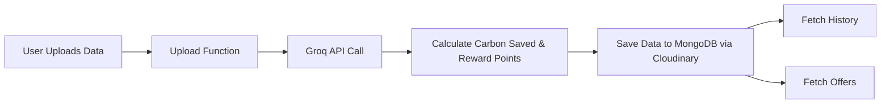

# eco-scan-challenge

## what is eco scan?
it's a tool that will personalise the shopping experience of the user by providing deal breaking offers based on the carbon savings by the them 

## frontend
- reactjs 
- css 
- react router dom
- react hot toast
## backend 
- mongodb
- expressjs
- groq api (Llama 3.2 11B Vision (Preview))
- nodejs
- cloudinary

## flow of application 

## how to run the application ?
`git clone https://github.com/889-dj/eco-scan-challenge.git`
### Backend
- `cd eco-scan-challenge-backend`
- `npm i && npm start`
- routes
  - /api/scan -> will scan the image and calculate the results
  - /api/history -> will fetch all the record from the db and show them 
  - /api/offers -> will check if the user are eligible for reward or not 
  - /api/offers/redeem -> wiill check wether the reward is redeemable or not

### Frontend
- `cd eco-scan-challenge-frontend`
- `npm run dev`
- pages
  - scan
  - history
  - offers/rewards

## working video
https://www.loom.com/share/a8428f073e824f4bb1a992b4842562df?sid=0a7557ae-9a95-4278-b388-b79c623ac235
